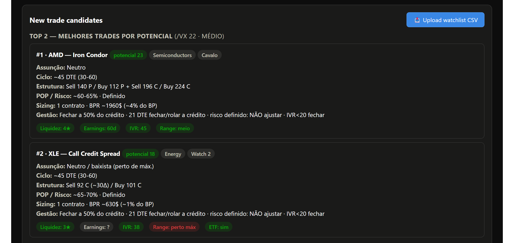
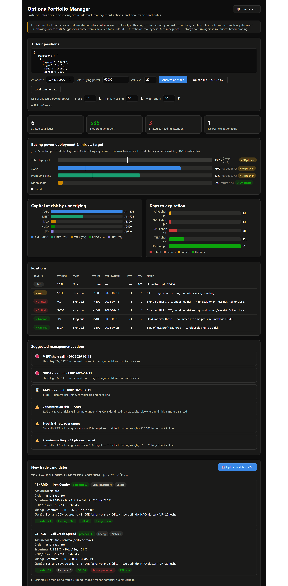

# Tastytrade Options Portfolio Manager

A local, single-file dashboard that pulls your Tastytrade positions and buying
power via the official API, then screens a watchlist for new trade candidates:
**option trades** (max 8) with a mechanical, Tastytrade-style methodology, and
**directional stock positions** (max 3) with a macro-first, Druckenmiller-style one.

> **Educational tool, not investment advice.** All analysis runs locally in your
> browser from the data you provide. Always confirm against live quotes before trading.

## Screenshots

New-trade candidates — the **best of 9 strategies** per name, with concrete strikes,
sizing and a management plan. The **/VX** you enter tilts the ranking (shown as the
regime label). *Sample data.*



<details>
<summary>Full dashboard — risk read, buying-power deployment, positions, management actions & candidates</summary>



</details>

## What it does

- **Authenticates** to the Tastytrade API with OAuth2 (refresh token).
- **Pulls** your open positions, live marks and buying power for the selected account.
- **Groups** option legs into strategies (verticals, strangles, iron condors, …)
  so risk and buying power reflect the combined structure.
- **Flags** management actions (21 DTE, ITM short legs, profit targets, …).
- **Screens** your Tastytrade watchlists for option candidates (max 8) — pulled from the API with IVR, IV,
  liquidity, earnings and 52-week range, so candidates are there on first open —
  and proposes the **best of 9 strategies** per candidate, with ~45 DTE, strikes at
  ~16Δ / ~30Δ, sizing and a management plan, ranked by potential and fit to your
  book. The **/VX** you enter tilts the ranking (low /VX → favour high individual
  IVR; high /VX → favour diversification). You can still upload a CSV to score a
  different list.

The 9 strategies considered: Short Strangle, Short Put, Put Credit Spread,
Call Credit Spread, Diagonal, Broken Wing Butterfly, Jade Lizard, Put Ratio
Spread, Iron Condor.

- **Proposes directional stock ideas separately** — up to **3** candidates, screened
  the Druckenmiller way rather than the premium way: pullback from the 52-week high,
  structure still intact, liquidity, earnings clear, beta weighed against the /VX
  regime, and one name per theme. Each card carries the vehicle (buy the shares, or
  get paid to wait with a ~30Δ put when IVR > 30; shorts only through ETFs), the
  invalidation level, and a **sizing ladder** — probe / core / high conviction — whose
  dollar size is derived from that invalidation level and capped by the volatility
  regime. The dashboard never writes the thesis: it demands the 18-month sentence
  before any entry is considered valid.

The two sleeves are kept apart on purpose. Premium selling is mechanical, small and
non-directional (close at 50%, roll at 21 DTE); the stock sleeve is a small number of
directional positions with no fixed profit target, cut when the thesis breaks.

## Requirements

- **Python 3** (standard library only — nothing to install).
- A Tastytrade **personal OAuth application** + grant (refresh token).
  See <https://developer.tastytrade.com/oauth/>.

## Setup & usage

```bash
py tastytrade_portfolio.py
```

1. **First run** asks for your OAuth *client secret* and *refresh token*. They are
   stored in `%LOCALAPPDATA%\TastytradePortfolio\oauth.json` (outside this repo) so
   later runs are non-interactive. The refresh token doesn't expire — revoke it on
   the site anytime.
2. Pick your account; the script fetches positions, buying power, and your
   watchlists with the metrics the screen needs.
3. Enter the current **/VX** level (or set it later in the dashboard).
4. It writes and opens **`dashboard.html`** with your data — positions *and*
   screened candidates — embedded.

### Uploading a CSV instead

To score a list that isn't in your Tastytrade watchlists, click **Upload watchlist
CSV**. Any CSV with a `Symbol` column works; recognised columns
(case/spacing-insensitive): `Mid` / `Mid/Price` / `Price`, `IV Rank`, `IV Idx`
(raw IV — needed for concrete strike estimates), `Liquidity`, `Earnings At`
(`Nov 4`, `2026-11-04` and `11/4/2026` all parse), `Corr SPY`, `52w High`, `52w Low`.
52-week ranges missing from the CSV are filled from the ranges the script embedded.

A **positions** CSV is auto-detected by the same button. It needs `Symbol` plus
either an OCC option symbol (`AAPL 260711P00180000`) or separate `Strike Price`,
`Exp Date` and `Call/Put` columns; `Quantity` (negative = short), `Trade Price`,
`Mark` and `Underlying Last Price` are used when present.

## Files

| File | Purpose |
|---|---|
| `tastytrade_portfolio.py` | API fetcher + dashboard generator |
| `dashboard-template.html` | The dashboard UI + analysis engine (source) |
| `dashboard.html` | Generated output with your data — *git-ignored* |
| `portfolio.json` | Your fetched data — *git-ignored* |

## Privacy

Your credentials (`Token.txt`, `oauth.json`) and your real broker data
(`portfolio.json`, `dashboard.html`) are **git-ignored** and never leave your
machine. The dashboard makes no automatic network calls — it only reads the data
you paste or upload.
